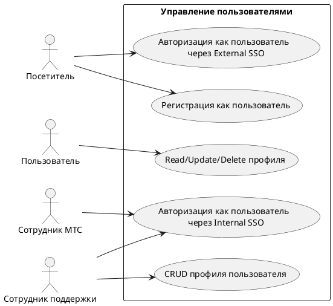

# Описание требований и архитектуры

## Введение
<!-- Общее краткое описание создаваемой системы -->
В рамках курса осуществляется проектирование решения на основе [постановки задачи от "заказчика"](../../task.md).

- [Описание требований и архитектуры](#описание-требований-и-архитектуры)
  - [Введение](#введение)
  - [Заинтересованные стороны](#заинтересованные-стороны)
  - [Бизнес-контекст (бизнес-требования)](#бизнес-контекст-бизнес-требования)
  - [Глоссарий](#глоссарий)
  - [Модель предметной области](#модель-предметной-области)
  - [Требования к системе](#требования-к-системе)
    - [Сценарии использования (Use case)](#сценарии-использования-use-case)
    - [Функциональные блоки](#функциональные-блоки)
    - [Функциональные требования](#функциональные-требования)
    - [Нефункциональные требования/Требования к атрибутам качества](#нефункциональные-требованиятребования-к-атрибутам-качества)
    - [Ограничения](#ограничения)
    - [Бизнес метрики](#бизнес-метрики)
    - [Требования к мониторингу](#требования-к-мониторингу)
  - [Архитектура](#архитектура)
    - [Журнал архитектурных решений](#журнал-архитектурных-решений)
    - [Контекст решения](#контекст-решения)
    - [Компонентная архитектура](#компонентная-архитектура)
    - [Реализация сценариев использования](#реализация-сценариев-использования)
    - [Программные интерфейсы](#программные-интерфейсы)
    - [Схема развертывания](#схема-развертывания)
  
## Заинтересованные стороны
| Заинтересованная сторона | Интересы           | Уровень влияния    | Уровень важности   | 
|:-------------------------|:-------------------|:-------------------|:-------------------|
|Нецелевая аудитория (слушатели из других сфер, а также не с территории РФ)|Новая информация|Низкий|Низкий|
|Местные органы власти|Соответствие законодательству|Низкий|Низкий|
|Юристы|Соблюдение законодательства и защиту интеллектуальной собственности|Низкий|Высокий|
|Потенциальные инвесторы, партнеры|Новые идеи, потенциальные бизнес интеграции, инвестиции|Низкий|Высокий|
|HR-специалисты|Формирование команды проекта и управление персоналом в ходе проекта|Низкий|Высокий|
|Аудиторы|Предоставление независимой оценки и рекомендации по улучшению|Низкий|Высокий|
|Рецензенты докладов и программы конференции|Качество информации|Низкий|Высокий|
|Ведущие и операторы мероприятия|Фокус аудитории|Низкий|Высокий|
|Рекламодатели|Доход от рекламы|Низкий|Высокий|
|Конкуренты|Целевая аудитория|Высокий|Низкий|
|Маркетологи|Количество посетителей|Высокий|Низкий|
|Поставщики оборудования|Доход от аренды|Высокий|Низкий|
|Интернет провайдер|Доход от обеспечения пропускной способности, известность|Высокий|Низкий|
|Организаторы конференции, спонсоры|Достижение целей мероприятия (повышение репутации, получение ЦА)|Высокий|Высокий|
|Докладчики|Известность, обмен знаниями, установление контактов|Высокий|Высокий|
|Целевая аудитория (слушатели из IT сферы, с территории РФ, потенциальные соискатели работы, студенты)|Обмен знаниями, получение предложений по работе, новые контакты, мерч|Высокий|Высокий|
|Отдел информационной безопасности, технические эксперты|Вопросы безопасности, инфраструктуры и масштабирования площадки|Высокий|Высокий|

## Бизнес-контекст (бизнес-требования)
| ID     | Группа            | Описание            |
|--------|------------------------|------------------------|
|BR.001|Удобство|Платформа должна быть легкой в использовании, предоставлять интуитивно понятный интерфейс для регистрации докладчиков и слушателей, через ключевые средства доступа (веб, мобайл). |
|BR.002|Удобство|Платформа должна позволять редакторам управлять расписанием докладов и изменять график, при необходимости (форс мажор у докладчика)|
|BR.003|Удобство|Платформа должна позволять пользователям выделять для себя избранные доклады и докладчиков и настраивать персональное расписание и оповещения|
|BR.004|Медиа|Платформа должна предоставить возможность пользователям делиться информацией о мероприятии через ключевые медиа (соц сети)|
|BR.005|Масштабируемость|Платформа должна обеспечивать возможность масштабирования, чтобы в случае необходимость обеспечить поддержку возрастающего числа слушателей (ожидается до 10 тыс человек, на основе предыдущего опыта)|
|BR.006|Качество|Платформа должна обеспечить высокое качество трансляции видео и звука, чтобы участники не испытывали трудностей с воспроизведением|
|BR.007|Интерактивность|Платформа должна позволять пользователям взаимодействовать как с докладчиками (задавать вопросы), так и с другими пользователями (чат), докладчики должны иметь возможность запускать онлайн опросы/викторины|
|BR.008|Интерактивность|Платформа должна предоставлять игровой функционал (лучшие вопросы и т.п.), чтобы пользователи могли получать бонусы и обменивать их на партнерский мерч|
|BR.009|Безопасность|Платформа должна обеспечить высокий уровень безопасности персональных данных докладчиков и слушателей, обеспечивать защиту от кибератак|
|BR.010|Аналитика|Платформа должна обеспечить возможность сбора и анализа данных, таких как количество участников, интерес к отдельным темам,  местоположение участников (города), оценки докладчиков|
|BR.011|Монетизация|Платформа должна обеспечить интеграцию с парнерами и спонсорами с целью интеграции продвижения их продукции|
|BR.012|Поддержка|Платформа должна обеспечить бесперебойную работу платформу на время мероприятия, а также обеспечить высокий уровень технической поддержки пользователей|
|BR.013|Историчность|Платформа должна обеспечить возможность записи и воспроизведения докладов, чтобы пользователи могли ознакомиться с ними в любое удобное время|
|BR.014|Обратная связь|Платформа должна предоставить возможность предоставления обратной связи, после проведения мероприятия|

## Глоссарий
| Понятие        | Описание     |
|--------------|----------------|
| Онлайн-конференция | Событие, которое проходит в интернете и позволяет участникам принимать участие в презентациях, дискуссиях и других мероприятиях без необходимости физически присутствовать на месте |
| Организаторы конференции | Люди или компании, которые создают и управляют конференцией |
| Спикеры | Люди, которые выступают на конференции и делятся своими знаниями и опытом |
| Участники | Люди, которые принимают участие в конференции |
| Спонсоры | Компании, которые финансируют конференцию и предоставляют свои продукты и услуги участникам |
| Партнеры | Компании, которые сотрудничают с организаторами конференции и предоставляют свои продукты и услуги участникам |
| Контент | Материалы, которые предоставляются на конференции, включая презентации, видео, статьи и другие форматы |
| Трансляция | Процесс передачи контента в режиме реального времени |
| Платформа | Система, которая обеспечивает проведение онлайн-конференции, включая техническую поддержку, инструменты для создания и управления контентом, интеграцию социальных сетей и другие функции |
| Монетизация | Процесс генерации дохода от конференции, включая продажу билетов, спонсорских пакетов, рекламу и другие источники дохода |
| Аналитика | Сбор и анализ данных о конференции, включая количество участников, популярность контента, время просмотра и другие метрики |
| Интерактивность | Возможность для участников взаимодействовать друг с другом и с контентом, например, задавать вопросы спикерам или принимать участие в опросах |
| Бизнес-требования | Список функциональных и нефункциональных требований, которые должны быть учтены при создании онлайн-конференции |
| Виртуальный стенд | Электронный стенд, на котором компании-спонсоры и партнеры могут показать свои продукты и услуги |
| Чат | Функция, которая позволяет участникам общаться между собой и задавать вопросы спикерам |

## [Модель предметной области](data/data.md)
| Бизнес Сущность | Подтипы |Данные     |
|-------------------------|-------------------------|-------------------------|
|Посетитель|Случайный/Рефферальный|Рефферальная ссылка, Дата/Время посещения |
|Пользователь | Слушатель/Докладчик/Редактор/Ведущий/Модератор/Техподдержка | ФИО, аватар, Статус, Уведомления вкл/выкл, Дата/Время регистрации, Дата/Время посещения, Возможность использовать чат, Количество бонусов|
|Транзакция бонусов | Начисление/Списание | Id Пользователя, Количество бонусов, Дата/Время транзакции|
|Контакты | email/телефон/телеграм | Id пользователя, Значение, Уведомления вкл/выкл|
|Мероприятие | | Наименование, Описание, Дата, Статус|
|Доклад |Несогласованный/Согласованный, Подтвержденный/Отмененный| Id пользователя, Id Мероприятия, Тема, Описание, Дата/Время проведения, Id секции, Статус согласования, Статус подтверждения, Ссылка на запись|
|Секция докладов | Dev/QA/DevOps/Management/Scrum/Support | Наименование, Цвет |
|Рецензия|Ответ редактора/Ответ докладчика| Id доклада, Id пользователя, Текст комментария, Дата/Время рецензии |
|Файл доклада | Презентация/Подстрочник/План выступления/Запись| Наименование файла, Ссылка в хранилище, Дата/Время создания |
|Посещение доклада | | Id доклада, Id пользователя, Дата/Время посещения|
|Избранные доклады | | Id Доклада, Id пользователя |
|Уведомляемые доклады | | Id Доклада, Id пользователя |
|Отзыв о докладе | | Id Доклада, Id пользователя, Текст, Дата/Время |
|Чат комната| | Id доклада |
|Чат сообщение |Сообщение/Вопрос/Ответ| Id чат комнаты, Id пользователя, Дата/время, Текст|
|Отзыв о мероприятии | |Id пользователя, Id мероприятия, Текст отзыва, Оценка, Дата/Время |
|Заявка в техподдержку |Жалоба/Технические неполадки/Отзыв о мероприятии|Id пользователя, Текст обращения, Дата/Время |
|Ответ на заявку | |Id заявки, Текст ответа, Дата/Время |

## Требования к системе

### Сценарии использования (Use case)

#### Диаграмма сценариев использования (Use Case Diagram) <!-- omit in toc -->

#### Список сценариев использования <!-- omit in toc -->

| ID     | Описание                                          |
|--------|---------------------------------------------------|
| UC.001 | *[Название сценария использования](uc/uc.001.md)* |

### Функциональные блоки

| ID | Функциональный блок |
|---------------------------|------|
|FB.01|Управление мероприятиями|
|FB.02|Управление пользователями (регистрации докладчик/слушатель, настройка профиля)|
|FB.03|Управление докладами (передача файлов, обратная связь, согласование)|
|FB.04|Управление расписанием докладов|
|FB.05|Управление персональным расписанием |
|FB.06|Управление уведомлениями|
|FB.07|Проведение конференции (трансляция, переключение камер, чат)|
|FB.08|Управление бонусами|
|FB.09|Управление записями докладов (загрузка, воспроизведение)|
|FB.10|Аналитика конференции|
|FB.11|Управление мониторингом|
|FB.12|Техподдержка|

### Функциональные требования

| ID | Система должна позволять | Функциональный блок |
|---------------------------|------|------|
|FR.01.001|Модераторам запускать новые мероприятия|Управление мероприятиями|
|FR.02.001|Посетителям осуществлять регистрацию как пользователь - слушатель|Управление пользователями|
|FR.02.002|Посетителям осуществлять регистрацию как пользователь - докладчик|Управление пользователями|
|FR.02.003|Внутренним сотрудникам авторизовываться как пользователь слушатель/докладчик/ведущий/модератор/оператор|Управление пользователями|
|FR.02.004|Пользователям управлять настройками профиля (email/телефон, ФИО, возраст, аватар, аккаунт телеграм)|Управление пользователями|
|FR.02.005|Администраторам видеть список пользователей и статус активности|Управление пользователями|
|FR.03.001|Докладчикам загружать тему, лендинг, презентацию и план выступления|Управление докладами|
|FR.03.002|Редакторам видеть список переданных в редакцию докладов|Управление докладами|
|FR.03.003|Редакторам оставлять обратную связь по докладам|Управление докладами|
|FR.03.004|Редакторам осуществлять согласование доклада|Управление докладами|
|FR.04.001|Редакторам создавать тематические секции докладов |Управление расписанием докладов|
|FR.04.002|Редакторам составлять расписание докладов (выбирать доклады, компоновать по секциям, указывать время)|Управление расписанием докладов|
|FR.05.003|Слушателям выбирать доклады в избранное|Управление персональным расписанием |
|FR.05.004|Слушателям получать сформированное расписание из избранных докладов|Управление персональным расписанием |
|FR.06.001|Слушателям настраивать канал уведомлений по докладам|Управление уведомлениями|
|FR.06.002|Слушателям устанавливать уведомления по всем докладам|Управление уведомлениями|
|FR.06.003|Слушателям устанавливать уведомления по отдельным докладами|Управление уведомлениями|
|FR.07.001|Слушателям получать ссылку на трансляцию доклада по выбранному каналу уведомлений|Проведение конференции|
|FR.07.002|Слушателям видеть тему и лендинг доклада, имя докладчика, время до старта, количество слушателей, чат|Проведение конференции|
|FR.07.003|Слушателям запускать трансляцию (веб, веб-мобайл)|Проведение конференции|
|FR.07.004|Операторам переключать фокус трансляции между ведущим, докладчиком и презентацией|Проведение конференции|
|FR.07.005|Слушателям видеть как презентацию, так и докладчика (уменьшенное изображение), на одном экране|Проведение конференции|
|FR.07.006|Слушателям и ведущим иметь возможность обмениваться сообщениями в чате|Проведение конференции|
|FR.07.007|Ведущим отличать вопросы от обычных сообщений в чате|Проведение конференции|
|FR.07.009|Модераторам иметь возможность блокирования сообщений пользователей в чате|Проведение конференции|
|FR.08.001|Ведущим начислять бонусы выбранным пользователям за лучшие вопросы|Управление бонусами|
|FR.08.002|Слушателям видеть список накопленных бонусов|Управление бонусами|
|FR.08.003|Слушателям переходить на лендинг бонусной страницы со списком доступного мерча|Управление бонусами|
|FR.08.004|Слушателям оставлять заявку на обмен бонусов на выбранный мерч|Управление бонусами|
|FR.08.005|Операторам маркетинга настраивать страницу мерча|Управление бонусами|
|FR.08.006|Операторам маркетинга получать на почту заявки на получение мерча|Управление бонусами|
|FR.09.001|Редакторам прикреплять запись доклада к карточке (если не будет формироваться автоматически)|Управление записями докладов|
|FR.09.002|Слушателям получать оповещение о завершенной трансляции с ссылкой на страницу для оффлайн доступа к докладу|Управление записями докладов|
|FR.09.003|Слушателям воспроизводить запись доклада со страницы платформы|Управление записями докладов|
|FR.09.004|Слушателям видеть тему, докладчика и дату записи трансляции|Управление записями докладов|
|FR.10.001|Отделу маркетинга отслеживать статистику по количеству онлайн пользователей|Аналитика конференции|
|FR.10.002|Отделу маркетинга отслеживать интерес аудитории по отдельным секциям докладов, по докладам|Аналитика конференции|
|FR.10.003|Отделу маркетинга отслеживать интерес аудитоиии к отдельным игровым интерактивам|Аналитика конференции|
|FR.10.004|Отделу маркетинга отслеживать число переходов по ссылкам на предложения партнеров|Аналитика конференции|
|FR.10.005|Партнерам получать выгрузку статистики переходов по ссылкам на предложения|Аналитика конференции|
|FR.11.001|Отделу поддержки отслеживать количество онлайн пользователей|Управление мониторингом|
|FR.11.002|Отделу поддержки мониторить состояние модулей системы|Управление мониторингом|
|FR.11.003|Отделу поддержки мониторить процесс автоматического масштабирования|Управление мониторингом|
|FR.12.001|Пользователям создавать заявки в техподдержку |Техподдержка|
|FR.12.002|Пользователям получать обратную связь по заявкам|Техподдержка|
|FR.12.003|Отделу поддержки обрабатывать заявки пользователей|Техподдержка|

### Нефункциональные требования/Требования к атрибутам качества

| ID     | Атрибут качества             | Описание требования                       |
|--------|------------------------------|-------------------------------------------|
|QR.001|Пропускная способность|Платформа должна обеспечивать достаточную пропускную способность для поддержки 10000 одновременных пользователей.|
|QR.002|Скорость работы|Платформа должна быстро реагировать на действия пользователей и обеспечивать плавный поток трансляции на 10000 каналов.|
|QR.003|Надежность|Платформа должна быть стабильной и надежной, чтобы обеспечить бесперебойную работу в течение всей конференции (доступность 99.5%).|
|QR.004|Доступность|Интерфейс платформы должен быть легковесным и использовать не более 200 Mb оперативной памяти на 1 страницу просмотра трансляции|
|QR.005|Безопасность|Платформа должна обеспечивать безопасность данных пользователей и защищать от взломов и кибератак, включая защиту от DDoS|
|QR.006|Масштабируемость|Платформа должна быть автоматически масштабируемой для поддержки большого количества пользователей и возможности дальнейшего расширения.|
|QR.007|Совместимость|Платформа должна быть совместима с различными устройствами, операционными системами и ключевыми браузерами (Chrome, Edge), чтобы обеспечить доступность для всех пользователей.|
|QR.008|Удобство использования|Платформа должна быть простой и удобной в использовании, чтобы пользователи могли легко находить необходимую информацию и взаимодействовать с другими участниками.|

### Ограничения
| ID     | Ограничение            |Описание                |
|--------|------------------------|------------------------|
|AC.001|Ограничения на бюджет|Стоимость разработки, запуска и эксплуатации платформы, ограничены бюджетом проекта, код RMS|
|AC.002|Ограничения на сроки|Платформа должна быть разработана не позднее конца 4го квартала 2023 года|
|AC.003|Ограничения на ПО|В платформе не может быть использовано более 50% библиотек, имеющих лицензии из 1й категории риска (GPL и т.п.)|
|AC.004|Ограничения на контент|Контент не должен нарушать авторские права, не содержать ненормативную лексику и не быть оскорбительным.|
|AC.005|Ограничения на доступность|Платформа должна быть доступна во всех регионах РФ, недопускается проведения ре-трансляции на зарубежных платформах|
|AC.006|Ограничения на безопасность|Платформа должна быть защищена от хакерских атак, вирусов и других угроз безопасности.|
|AC.007|Ограничения на конфиденциальность|Данные участников конференции должны быть защищены и не могут быть использованы без их согласия.|
|AC.008|Ограничения на монетизацию|Патформа не должна использовать недобросовестные методы монетизации, такие как скрытые платежи или навязчивая реклама.|
|AC.009|Ограничения на рекламу|Реклама не должна быть оскорбительной и не должна содержать ложной информации.|
|AC.010|Ограничения на использование данных участников|Данные участников не должнны быть использованы для целей маркетинга или продажи третьим сторонам.|
|AC.011|Ограничения на соответствие нормам законодательства|Платформа должна обеспечивать уровень безопасности для защиты персональных данных пользователей в соответствии с 152ФЗ |

### Бизнес метрики
| ID     | Метрика            |
|--------|------------------------|
|BM.001|Количество зарегистрированных пользователей.|
|BM.002|Количество посетителей сайта.|
|BM.003|Количество просмотров страниц.|
|BM.004|Среднее время нахождения на сайте.|
|BM.005|Среднее время нахождения на докладе.|
|BM.006|Количество зарегистрированных спонсоров и партнеров.|
|BM.007|Количество просмотров рекламных материалов/переходов по ссылкам|
|BM.008|Количество участников конференции.|
|BM.009|Количество вопросов и ответов на платформе.|
|BM.010|Уровень удовлетворенности пользователей.|
|BM.011|Количество обращений в техподдержку.|
|BM.012|Количество обращений на получения мерча за бонусы.|

### Требования к мониторингу
| ID     | Тип            |Описание                 |
|--------|------------------------|------------------------|
|MR.001|Мониторинг производительности|Мониторинг пропускной способности и скорости работи может включать отслеживание времени загрузки страниц, скорости передачи данных, времени отклика и других метрик производительности. Также может быть настроен превентивный мониторинг с помощью инстурментов проведения нагрузочного тестирования|
|MR.002|Мониторинг доступности|Мониторинг надежности и доступности может включать проверку наличия и корректности работы серверов, мониторинг ошибок и сбоев, а также проверку доступности функций и сервисов.|
|MR.003|Мониторинг безопасности|Мониторинг безопасности может включать проверку наличия и корректности работы механизмов аутентификации, авторизации и шифрования, мониторинг потенциальных уязвимостей и атак, а также проверку соответствия стандартам безопасности.|
|MR.004|Мониторинг удобства использования|Мониторинг удобства использования может включать сбор отзывов и обратной связи от пользователей, анализ пользовательских действий и поведения, а также тестирование пользовательского интерфейса и функциональности.|
|MR.005|Мониторинг совместимости|Мониторинг совместимости может включать проведение автоматических тестов в разных браузерах, с использованием специализированных инструментов тестирования, таких как Cypress|
|MR.005|Мониторинг изменений|Мониторинг изменений может включать отслеживание новых версий и обновлений, анализ изменений и улучшений, а также сбор отзывов и обратной связи от пользователей.|

## Архитектура

### Журнал архитектурных решений
<!-- Записи о ключевых принятых архитектурных решениях (ADR) для реализации архитектурно-значимых требований.
Подробнее: https://confluence.mts.ru/pages/viewpage.action?pageId=421162308
-->
- [ADR.NNN Суть решения](adr/adr-template.md)

### [Контекст решения](context/context.md)

### [Компонентная архитектура](components/components.md)

### Реализация сценариев использования
<!-- Реализация сценариев использования на основе взаимодействия компонентов системы и внешних систем/участников.
Диаграммы последовательности (UML Sequence diagram) и текстовое описание.

Подробнее: 
https://confluence.mts.ru/pages/viewpage.action?pageId=399442132
https://confluence.mts.ru/pages/viewpage.action?pageId=399442170
-->
| ID     | Описание                          | Реализация                                    |
|--------|-----------------------------------|-----------------------------------------------|
| UC.001 | *Название сценария использования* | [Реализация сценария](uc-impl/uc.001-impl.md) |

### Программные интерфейсы
<!-- Спецификации публичных API системы и ее компонентов (синхронных, событийных). Создается на основе модели предметной области для реализации сценариев использования. 
  Форматы: OAS/Swagger, GraphQL, AsyncAPI/CloudEvents
-->
| Компонент             | Интерфейс                                      |
|:----------------------|:-----------------------------------------------|
| *Название компонента* | *[Название интерфейса](api/service-name.yaml)* |

### [Схема развертывания](deployment/deployment.md)
