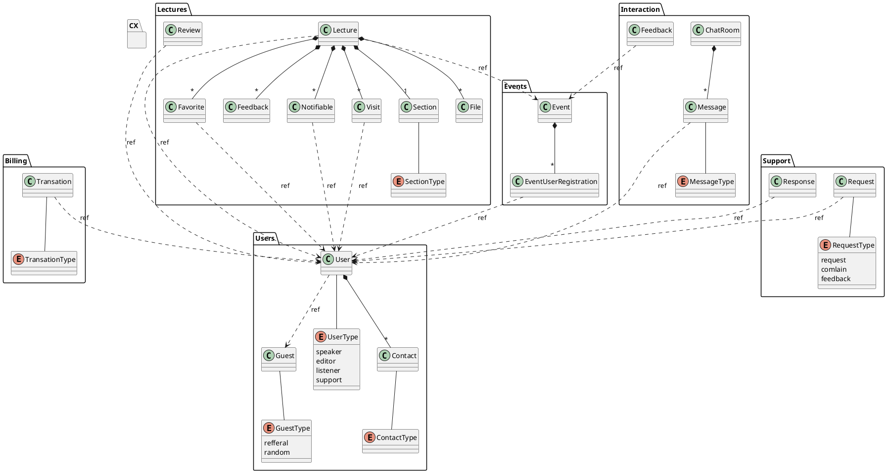

# Модель предметной области
| Бизнес Сущность | Подтипы |Данные     |
|-------------------------|-------------------------|-------------------------|
|Посетитель|Случайный/Рефферальный|Рефферальная ссылка, Дата/Время посещения |
|Пользователь | Слушатель/Докладчик/Редактор/Ведущий/Модератор/Техподдержка | ФИО, аватар, Статус, Уведомления вкл/выкл, Дата/Время регистрации, Дата/Время посещения, Возможность использовать чат, Количество бонусов|
|Транзакция бонусов | Начисление/Списание | Id Пользователя, Количество бонусов, Дата/Время транзакции|
|Контакты | email/телефон/телеграм | Id пользователя, Значение, Уведомления вкл/выкл|
|Мероприятие | | Наименование, Описание, Дата, Статус|
|Доклад |Несогласованный/Согласованный, Подтвержденный/Отмененный| Id пользователя, Id Мероприятия, Тема, Описание, Дата/Время проведения, Id секции, Статус согласования, Статус подтверждения, Ссылка на запись|
|Секция докладов | Dev/QA/DevOps/Management/Scrum/Support | Наименование, Цвет |
|Рецензия|Ответ редактора/Ответ докладчика| Id доклада, Id пользователя, Текст комментария, Дата/Время рецензии |
|Файл доклада | Презентация/Подстрочник/План выступления/Запись| Наименование файла, Ссылка в хранилище, Дата/Время создания |
|Посещение доклада | | Id доклада, Id пользователя, Дата/Время посещения|
|Избранные доклады | | Id Доклада, Id пользователя |
|Уведомляемые доклады | | Id Доклада, Id пользователя |
|Отзыв о докладе | | Id Доклада, Id пользователя, Текст, Дата/Время |
|Чат комната| | Id доклада |
|Чат сообщение |Сообщение/Вопрос/Ответ| Id чат комнаты, Id пользователя, Дата/время, Текст|
|Отзыв о мероприятии | |Id пользователя, Id мероприятия, Текст отзыва, Оценка, Дата/Время |
|Заявка в техподдержку |Жалоба/Технические неполадки/Отзыв о мероприятии|Id пользователя, Текст обращения, Дата/Время |
|Ответ на заявку | |Id заявки, Текст ответа, Дата/Время |

